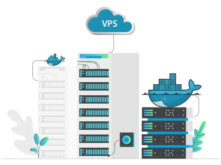
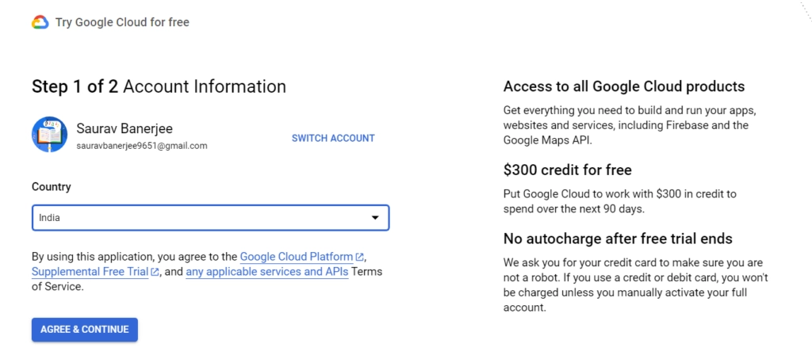
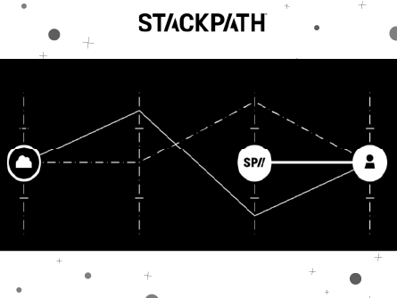
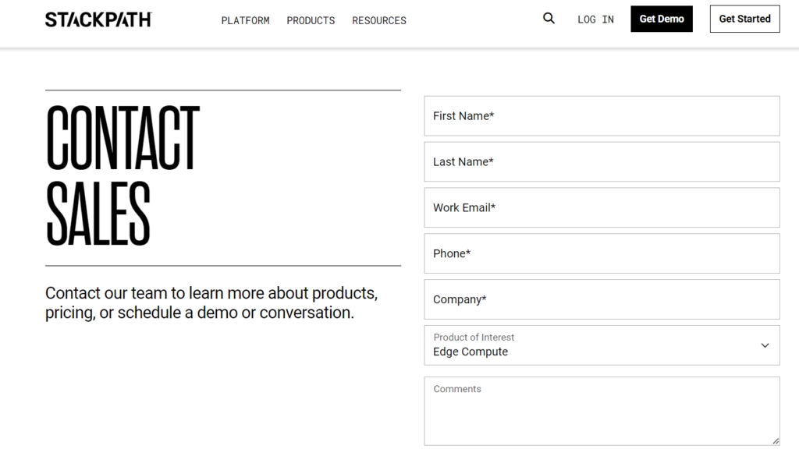

# Top 10 Docker VPS Hosting Providers for Modern Developers

---

Looking to run multiple applications seamlessly across different servers without configuration headaches? Docker VPS hosting leverages containerization technology to package your apps with all their dependencies, letting them run smoothly anywhere. Whether you're managing microservices, deploying development environments, or scaling web applications, choosing the right Docker VPS provider directly impacts your deployment speed, cost efficiency, and system stability.

---

## What Makes Docker VPS Hosting Different?

Before diving into providers, let's break down what we're actually talking about here.

Docker is essentially a tool that creates containers. Think of these containers as self-contained packages holding your application plus everything it needs to run—code, libraries, dependencies, the whole deal. The beauty? Once packaged, that container runs the same way on any server.

Docker VPS hosting providers give you the scalable infrastructure (RAM, CPU, storage, operating systems) needed to run these containers efficiently. This modern approach works brilliantly for developers juggling multiple projects who need consistent environments across different platforms.

The old way meant installing and configuring everything manually on each server. With Docker, you build once and deploy everywhere. That's the game-changer.

## The Top 10 Docker VPS Hosting Providers in 2025

Here's the rundown of providers that actually deliver on Docker hosting promises:

**Quick Navigation:**
1. **Kamatera** - Best overall Docker VPS hosting
2. **DigitalOcean** - Top-tier Docker VPS platform
3. **ScalaHosting** - Excellent managed Docker VPS
4. **Hosting.com** - Developer-friendly Docker environment
5. **LiquidWeb** - High-performance Docker infrastructure
6. **Vultr** - Fast SSD-powered Docker hosting
7. **Contabo** - Flexible cloud VPS instances
8. **Linode** - Affordable Docker solutions
9. **Google Cloud** - Enterprise-grade cloud VPS
10. **StackPath** - Edge computing Docker platform

### 1. Kamatera – Best Overall Docker VPS Hosting

Kamatera approaches Docker hosting with enterprise-level cloud computing infrastructure. They offer at least 1-core processors and Ubuntu Server OS optimized for running containers smoothly.

What sets Kamatera apart is their pricing calculator—you pay only for resources you actually need. No bloated packages forcing you to buy features you'll never use.

**Key Features:**
- **Flexible pricing calculator**: Choose exactly what you need, pay by the hour
- **Load balancing modules**: Distribute workloads evenly across your infrastructure
- **24/7 support**: Live chat and ticketing system for technical issues
- **Highly scalable**: Upgrade or downgrade resources easily as container needs change

Kamatera offers a 30-day free trial with no hidden fees. For developers testing Docker deployments or running variable workloads, this flexibility is hard to beat.

### 2. DigitalOcean – Top Docker VPS Platform

Founded in 2012, DigitalOcean built its reputation serving web creators and small-to-medium businesses. Their Docker hosting includes container registry, automatic updates, and managed Kubernetes for orchestration.

DigitalOcean's managed Kubernetes service handles container deployment and maintenance, letting you focus on application development instead of infrastructure management.

**Key Features:**
- **Advanced security**: DDoS protection and free SSL certificates included
- **Block storage and load balancers**: Distribute loads and store data efficiently
- **24/7 support**: Live chat and ticket support available
- **Fully managed Docker**: Perfect for those new to containerization

If you're looking for streamlined Docker deployments without the complexity, DigitalOcean delivers. 👉 [Explore powerful VPS solutions designed for containerized workloads with enterprise-grade reliability](https://www.vultr.com/?ref=9738262-9J)—a smart choice when scalability and performance matter.

### 3. ScalaHosting – Best Managed Docker VPS

ScalaHosting simplifies Docker deployment on VPS servers, supporting Linux, MacOS, and Windows environments. You can host multiple applications on the same VPS while keeping each app and its dependencies isolated from others.

**Key Features:**
- **Container isolation**: Apps stay secure and separated from each other
- **Simplified backups**: Transform Docker containers into images for easy backups
- **Multiple OS support**: Ubuntu, CentOS for Linux and Windows environments
- **24/7 LiveExpert support**: Assistance for users unfamiliar with containers

ScalaHosting's approach works well for developers who want managed services but still need control over their container environments.

### 4. Hosting.com – Developer-Friendly Docker VPS

Hosting.com runs Docker containers on their SwiftServer platform, delivering lightning-fast performance. Their infrastructure lets developers run different PHP applications in various versions with separate dependencies.

**Key Features:**
- **Multiple PHP versions**: Install different PHP versions with their dependencies in containers
- **Ultra-reliable servers**: Fast, dependable infrastructure for optimal page load speeds
- **99.90% uptime guarantee**: Ensures continuous availability for your applications
- **24/7 support**: Technical assistance that meets customer expectations

For PHP developers managing projects across different framework versions, Hosting.com removes compatibility headaches.

### 5. LiquidWeb – High-Performance Docker VPS

LiquidWeb enables running applications in container isolation using the same operating system. Their Docker containers are lightweight, highly scalable, and properly secured against online attacks.

**Key Features:**
- **Highly scalable plans**: Upgrade or downgrade resources based on application needs
- **24/7 support**: LiveChat and ticketing system assistance
- **Flexible pricing**: Pay only for features required for hosting containers
- **Fully managed containers**: Focus on application development while they handle infrastructure

LiquidWeb currently offers 50% off for 3 months on their VPS plans—worth checking if you're launching new container-based projects.

### 6. Vultr – Fast SSD Docker VPS

Vultr offers a one-click Docker application that installs DockerCE, providing the platform needed to run containers. Available with both CentOS and Ubuntu operating systems, it comes pre-configured with top-tier security mechanisms.

**Key Features:**
- **One-click Docker installer**: Install DockerCE to run various containers easily
- **Robust infrastructure**: Top-tier security protecting container contents
- **Highly scalable plans**: Upgrade and downgrade as needed
- **24/7 support**: LiveChat and ticketing system available

Vultr includes regular Docker application updates, letting developers focus solely on application performance. When you need reliable infrastructure for Docker workloads, 👉 [discover high-performance cloud computing built for containerized applications](https://www.vultr.com/?ref=9738262-9J) with global availability and consistent uptime.

### 7. Contabo – Fast and Flexible Cloud VPS

With 99.996% guaranteed uptime and global availability, Contabo offers Docker hosting that creates consistent environments for applications in containers, enabling them to run on any server.

**Key Features:**
- **Highest uptime**: 99.996% guaranteed availability for online applications
- **Advanced security**: DDoS protection and container-based security measures
- **24/7 customer support**: Helps newcomers solve container-related issues
- **Easy Docker installation**: Simple setup lets developers focus on application development

Contabo's competitive pricing and robust infrastructure make it attractive for budget-conscious developers who won't compromise on reliability.

### 8. Linode – Affordable Docker VPS Solutions

Linode provides comprehensive cloud computing products including Docker hosting that helps create containers providing isolated environments for web applications with their dependencies.

Their Marketplace section allows developers to install Docker through simple cloud manager login.

**Key Features:**
- **Zero price opacity**: Contact sales team for pricing and various Docker hosting plans
- **Marketplace installation**: Deploy Docker in cloud instances via cloud manager
- **24/7 customer support**: Expert assistance enabling new users to handle setup
- **Highly scalable plans**: Increase or decrease resources required for hosting containers

Linode balances affordability with functionality—solid choice for developers watching budgets without sacrificing container performance.

### 9. Google Cloud – Best Cloud Docker VPS

Google Cloud offers software containers enabling developers to run applications on multiple Linux or Windows servers. Their containers allow applications to run with fewer server dependencies.

Google Cloud also provides Google Kubernetes Engine, simplifying cluster management so you don't worry about container management complexities.

**Key Features:**
- **Container management engine**: Kubernetes lets developers focus on application development
- **Free trial services**: Test basic containerization features before committing
- **24/7 support**: LiveChat and ticketing system for users with zero technical knowledge
- **Instant container deployment**: Containers with isolated application environments deploy within minutes

Google Cloud suits enterprises needing robust container orchestration with the backing of Google's infrastructure.

### 10. StackPath – Cloud Computing Web Solutions

StackPath offers container hosting services providing GPU-accelerated workloads, low-latency application servers, and seamless multi-cloud support, enabling developers to run multiple applications on different servers.

**Key Features:**
- **Bandwidth optimization**: 100% fully optimized bandwidth for running applications on any server
- **Free demo**: Test container and Docker services before committing
- **24/7 support**: Helps beginner users solve problems within minutes
- **Very low latency**: Ensures fast load speeds and constant application availability

StackPath focuses on edge computing, making it ideal for applications requiring low-latency responses across geographic regions.

## How to Choose Your Docker VPS Provider

Picking the right provider comes down to matching your specific needs with what they offer. Here's what actually matters:

**Infrastructure Quality**: Look for providers offering dedicated resources, SSD storage, and modern processors. Your containers deserve solid hardware underneath.

**Scalability**: Your needs will change. Choose providers letting you adjust resources quickly without downtime or complicated migrations.

**Managed vs Unmanaged**: Know your skill level. Managed services cost more but save time if you're not a DevOps expert. Unmanaged gives full control but requires technical chops.

**Security Features**: Container isolation is great, but you still need DDoS protection, SSL certificates, and regular security updates.

**Support Quality**: When containers fail at 2 AM, responsive support matters. Test their response times before committing.

**Pricing Structure**: Some charge hourly, others monthly. Make sure you understand what's included and what costs extra (bandwidth, snapshots, load balancers).

**Geographic Location**: Server proximity affects latency. Choose providers with data centers near your user base.

## Docker vs Traditional VPS: The Real Difference

**Docker Hosting** uses OS-level virtualization, creating containers that share the host operating system. This makes them lightweight, fast to start, and resource-efficient.

**Traditional VPS** uses hardware-level virtualization (like KVM), creating completely separate virtual machines with their own operating systems. More resource-intensive but stronger isolation.

Docker shines when you need to run multiple applications with different dependencies on the same server. Traditional VPS works better when you need full OS control or must run entirely different operating systems.

## Frequently Asked Questions

**What's the best server for Docker?**
DigitalOcean, Kamatera, and ScalaHosting top the list thanks to fully managed plans, advanced security for isolated container environments, high scalability, and affordable pricing.

**Best operating system for Docker hosting?**
Ubuntu Server dominates for general Docker hosting. Windows Server works for Windows-based containers. Your choice depends on your use case, Docker version compatibility, and security requirements.

**Docker or Kubernetes—which is better?**
They serve different purposes. Docker creates and runs containers. Kubernetes orchestrates and manages multiple containers, handling scaling, load distribution, and ensuring 24/7 availability. You typically use both together.

**Docker vs VPS—what's the difference?**
Docker provides OS-level virtualization through containers. VPS offers hardware-level virtualization creating completely separate virtual servers. Docker containers are lighter and faster; VPS provides stronger isolation and full OS control.

---

## Final Thoughts

Docker VPS hosting represents a significant leap forward for web developers. The containerization technology Docker provides offers reliable, highly scalable environments for building and configuring applications with optimal performance and security.

The providers we've covered deliver genuine solutions for running applications smoothly across different servers. Your choice depends on your specific needs—managed vs unmanaged, budget constraints, geographic requirements, and technical expertise.

Whether you're deploying microservices, managing development environments, or scaling production applications, Docker VPS hosting removes configuration headaches and lets you focus on what matters: building better applications.
